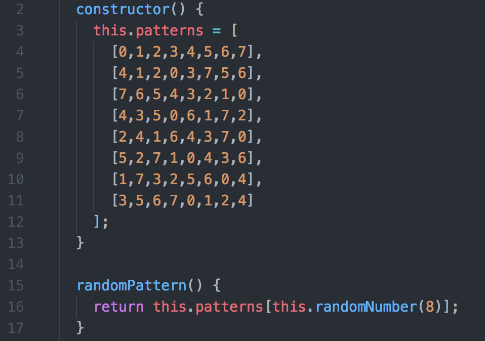
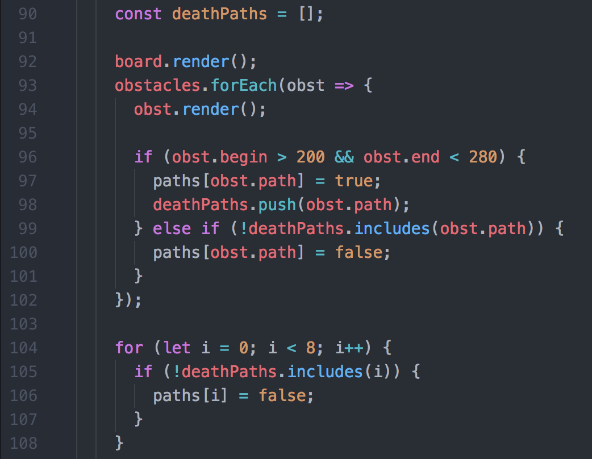

# Wormhole

[Live Link](https://masonanders.github.io/Wormhole/)

Navigate your way through a wormhole at speeds nearing that of light while you avoid pockets of strange energy that would surely be the end of you should you collide with too many along the way.

The player can navigate clockwise or counter-clockwise around the circumference of the circle while dodging oncoming obstacles which fly towards the player's avatar at high-speeds.

This game was made using vanilla JavaScript for the logic with a HTML5 Canvas element to render the visuals.

[Proposal](./docs/proposal.md)

## Features and Implementations

#### Pseudo-3D Effects

Objects grow in size and speed as they move away from the middle of the screen creating a 3D illusion. This was done using a constant speed variable throughout the application that was used to update object positions, sizes, and opacity exponentially with each frame render.

#### Randomly Picked Patterns

Instead of randomly generating obstacle paths, which would occasionally send obstacles flying down the same few paths multiple times due to the random nature of randomness, I decided to write several short, pre-determined patterns. Those patters were stored in an array and executed one at a time. Once a pattern had completed it's lifecycle, another pattern was then chosen at random to maintain an unpredictable experience.

#### Efficient Collision Detection

Since the ship's distance from the center of the circle is constant and the positions the ship can occupy are limited and relatively small in number, I chose to implement a minimal form of collision detection.

Rather than keep track of the ship's and each object's occupied coordinates and their areas, I instead kept track of each of the eight section's states. Sections are stored in an object with their id as a key and state as a boolean value of each key. If an obstacle's outer radius is greater than that of the radius of the ship's front and it's inner radius is less than that of the ship's back, that section becomes a "danger" section. If the ship exists in a section while it is in a "danger" state, the player takes damage for each frame that it maintains a "danger" state.

This checks each obstacle and if it is in a "danger zone" it's section's "danger" state is set to `true` and the id is pushed to a local array. Otherwise if the obstacle is not in a "danger zone" and it's section is *not* included in the current array of `deathPaths` it changes it's section's "danger state" to `false`. Lastly any section that has no obstacle currently in it has it's "danger" state reset to `false`.

#### Efficient Visual Designs

Entities that are numerous in number are kept only while needed in order to preserve memory. Each instance of an Obstacle and/or Star (white specks in the background) are stored in an array that is iterated through to render the object. That array has a limit to it's length and once that limit is reached the array is shifted to remove an old object each time a new object is push on to it.

#### Object Oriented Programing and Code Organization

From the beginning of this project I held good OOP practices as a high priority. Each class takes care of it's own logic and each visible class has it's own `render()` function that was then called only by a parent class in order to comply with the Law of Demeter.

An `app.js` was file was used for the basic page functionality and event listeners. Upon DOM-load it created a new instance of the game class in `wormhole.js`, which in turn took care of general game setup and then rendered each other class in the appropriate order, each class instance took care of it's own positions and drew them on the given `context` constant passed down from `app.js`. This follows a pattern of "Tell, Don't Ask", in which it is considered good practice to leave logic up to the subject by giving it parameters if need instead of determining what the subject should be doing based on local information.

Because of this good practice, on the case that I decided I needed to refactor my code the effort and time needed for the transition was minimal and issues that popped up were easy to address. Keeping up this practice will be a priority of mine from here on during my career when going into new or existing projects as the effort to keep organized code was minimal and the outcome was ideal.

## Future Features may include

* Rare generation of a shield regenerating obstacle.
* Gradually increasing obstacle spawn rates.
* Obstacles can spawn more than one at a time.
* Temporary turret upgrade to destroy obstacles.
* Temporary enemy that chases player around circle.
* High score backend database.
