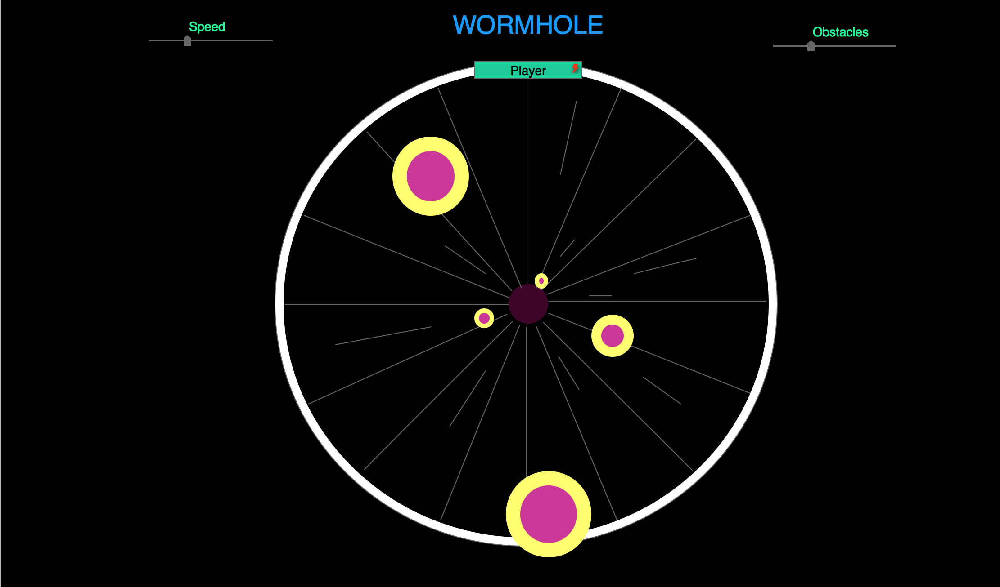

## Wormhole

Navigate your way through a wormhole at speeds near that of light while you avoid pockets of strange energy that would surely be the end of you should you collide with one along the way.

The player can navigate clockwise or counter-clockwise around the circumference of the circle while dodging oncoming obstacles which increase in number and speed over time.

[Proposal](./docs/proposal.md)
